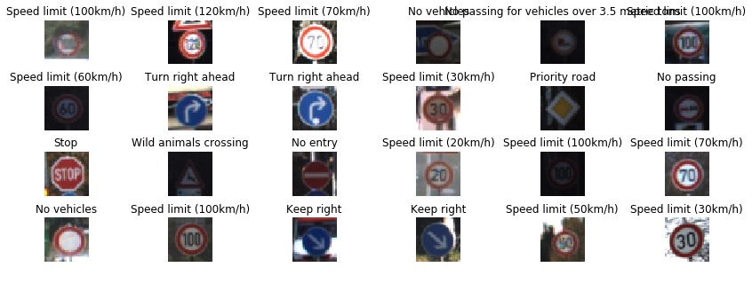

## Project: Build a Traffic Sign Recognition Program

Overview
---
In this project, I used Deep Neural Networks and Convolutional Neural Networks to classify traffic signs. I trained and validated a model so it can classify traffic sign images using the [German Traffic Sign Dataset](http://benchmark.ini.rub.de/?section=gtsrb&subsection=dataset). After the model was trained, I tried out my model on images of German traffic signs that I found on the web.

The goals / steps of this project were the following:
* Load the data set (see below for links to the project data set)
* Explore, summarize and visualize the data set
* Design, train and test a model architecture
* Use the model to make predictions on new images
* Analyze the softmax probabilities of the new images
* Summarize the results with a written report

Rubric Points
---
Here I will consider the [rubric points](https://review.udacity.com/#!/rubrics/481/view) individually and describe how I addressed each point in my implementation.  

**1. Data Set Summary & Exploration**

I used Python's Numpy library to calculate summary statistics of the traffic
signs data set:

* The size of training set is 34799
* The size of the validation set is 4410
* The size of test set is 12630
* The shape of a traffic sign image is (32,32,3)
* The number of unique classes/labels in the data set is 43

**2. Exploratory visualization of the dataset.**

Here is an exploratory visualization of the data set. It is a bar chart showing how the training data is distributed:

And in this figure, a few random images from the training dataset are displayed:

Here is the figure of a few images with the same label (In this case, a speed limit of 80 Km/hr):

**3. Design and Test a Model Architecture**

As it can be seen from the above visualization, there are lots of labels for which sufficient images are not present and for that reason, I decided to generate addition training data. Getting more images from the internet is one option, however, I didn't want to unnecessary energy in that and decided to generate additional data using TensorFlow and Open-CV's in-built functions to rotate, translate and alter the brightness of already existing images. I also tried Homography to get additional data. For the images with total number of labels below the overall mean, I simply generated more images (fake data) through these operations and then assigned the same label value for their desired labels. As a result of this operation, I was able to increase my training data size to around 44000 (With more than 9000 fake images generated.). 
Here is an example of an original image and an augmented image:

    

Next, comes the preprocessing part. I first normalized my images to have a value in between -1 and +1 (instead of 0 and 255) and then converted them to grayscale. The output as a result of the operations can be seen in the below images.

    

Here is an example of a traffic sign image before and after grayscaling.

    

**Final Architecture**

My final model architecture was based on [Yan Lecun's Lanet Architecture.](http://yann.lecun.com/exdb/lenet/) and it consisted of the following layers:

| Layer         		|     Description	        					| 
|:---------------------:|:---------------------------------------------:| 
| Input         		| 32x32x3 RGB image   							| 
| Convolution 5x5     	| 1x1 stride, valid padding, outputs 28x28x6 	|
| RELU					|												|
| Max pooling	      	| 2x2 stride,  outputs 14x14x6  				|
| Convolution 5x5	    |  1x1 stride, valid padding, outputs 10x10x16 	|
| RELU					|												|
| Max pooling	      	| 2x2 stride,  outputs 5x5x16  				|
| Fully connected		| inputs 400, outputs 120        									|
| RELU					|		
| Dropout					|	Keep_probability  0.8											|
| Fully connected		| inputs 120, outputs 84        									|
| RELU					|		
| Dropout					|	Keep_probability  0.8											|
| Fully connected		| inputs 84, outputs 43        									|
| Softmax				|        									|

**Training the model**

After ensuring that the number of my training features is same as the number of labels, I started training the model. I varied my learning rate from 0.0005 to 0.01 and settled for 0.001. Used 45 epochs, batch size of 32 and Adam Optimizer to minimize my loss operation. I obtained a training accuracy of 98.8% and a validation accuracy of 94% for my data.

I had initially obtained a very high (almost 100%) training accuracy with only 90% validation accuracy and realized that I need to introduce regularization and that's when I included dropout in the Fully-Connected layers. I was glad to obtain a test accuracy of 91% on entirely new dataset.

My final model results were:
* training set accuracy of 98.8%
* validation set accuracy of 93.5%
* test set accuracy of 90.9%

I had also initially trained without including augmented images and was not satisfied with the result so their inclusion really helped a lot. I played around with all the hyperparameters and settled with the one which gave me the best validation and training accuracy combination. 
 

**Test a Model on New Images**

For testing the data on the new images of the web, I found these five German traffic signs:

    

The second image might be hard to test on because it looks very blurred upon converting to a size of 32x32. And the fourth image might be hard because it is very similar to STOP sign (from the dataset). The model was able to correctly guess 5 of the 6 traffic signs, which gives an accuracy of 83.33%. This compares favorably to the accuracy on the test set of 91%

I, as a final stage of this project, outputed how confident my model is, while predicting the logits and drew bars corresponding to the confidence (probability). From the image below, it can be seen that the probability of accurate predictions is almost 100% for all the cases.

    

Here are the predictions for the images

| Image			        |     Prediction	        					| 
|:---------------------:|:---------------------------------------------:| 
| STOP Sign      		| STOP Sign  									| 
| Speed Limit (50 km/h)					| Speed Limit (50 km/h)											|
| Yield     			| Yield										|
| Speed Limit (30 km/h)					| STOP Sign			 				|
| Yield     			| Yield										|
| Speed Limit (100 km/h)					| Speed Limit (100 km/h)											|

